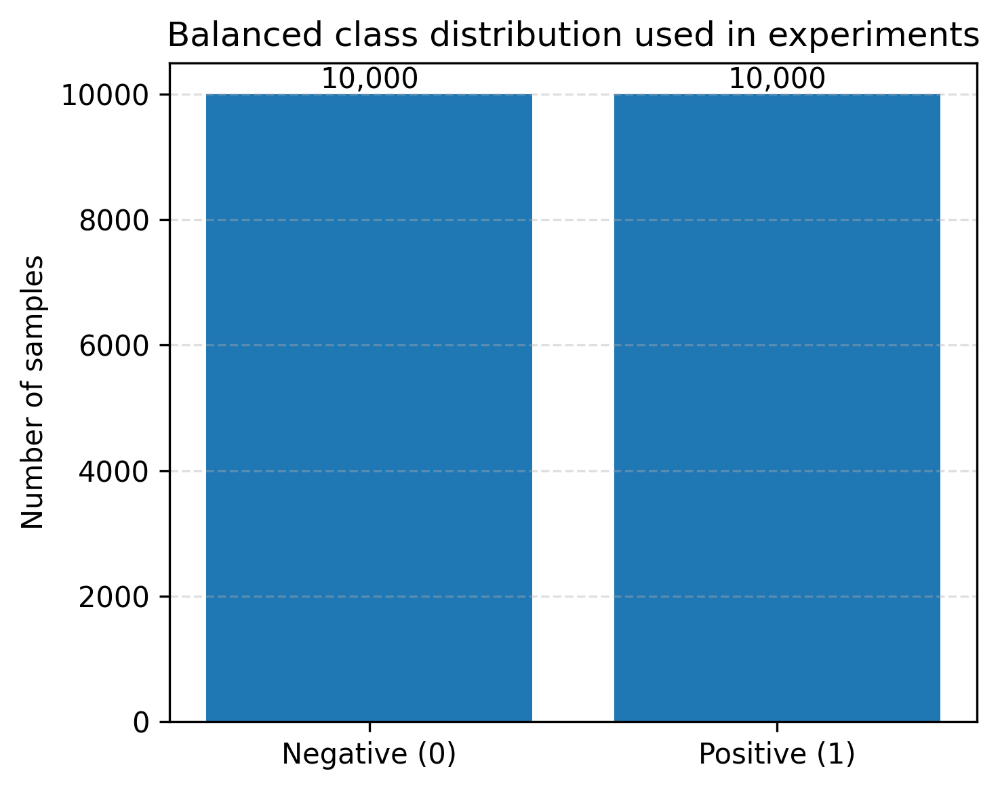
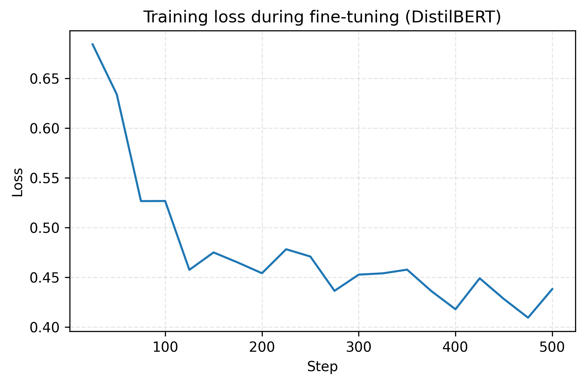
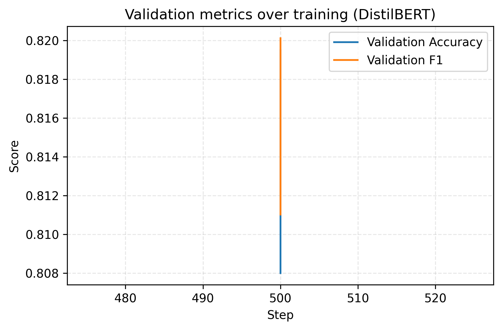
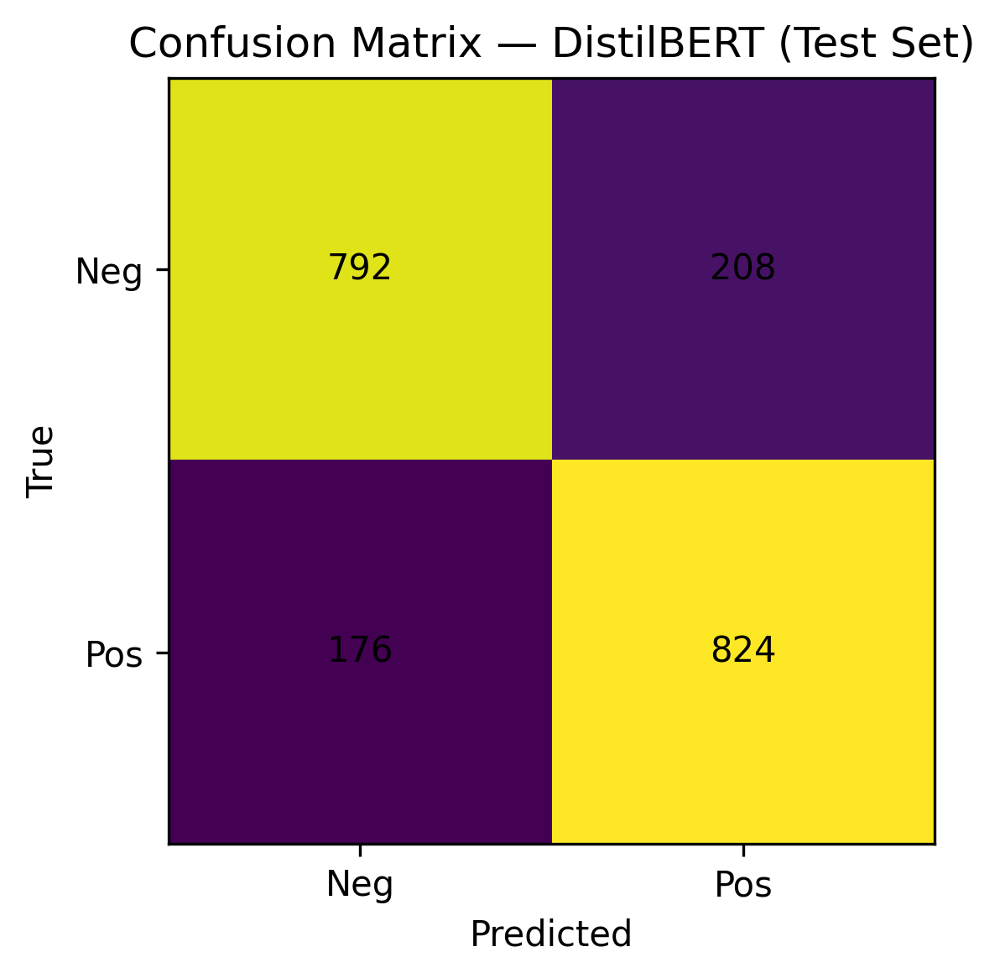
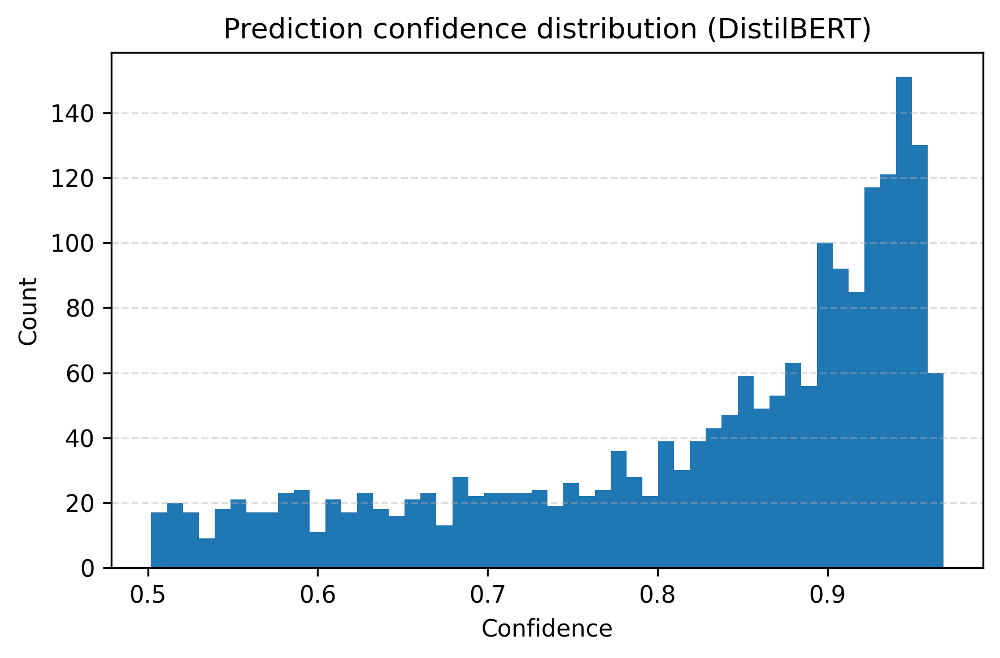
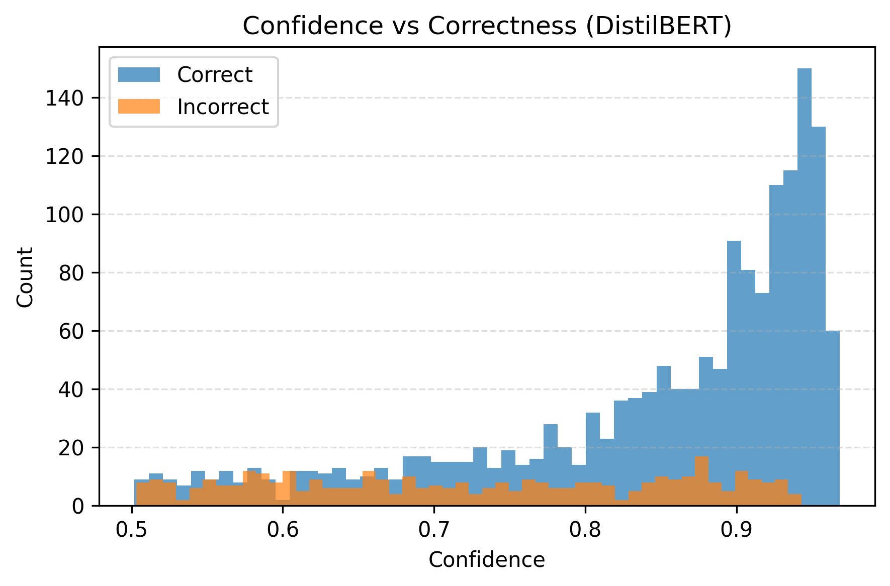

# Sentiment Analysis Project (NLP)

This project implements sentiment analysis on Twitter data using both traditional machine learning and modern Transformer-based approaches. The goal is to analyze short, informal social media text and classify it as either positive or negative sentiment.

The project includes:
- A baseline machine learning model using TF-IDF + Logistic Regression
- A Transformer-based model using BERT / DistilBERT

The project is designed to be fully runnable on any machine from a clean clone. Large datasets and trained models are not stored in GitHub, so you will download data and generate outputs locally.

## Project Structure

```text
sentiment-analysis/
│
├── app.py                  # Application entry point (user interface)
├── requirements.txt        # Python dependencies
├── README.md               # Project documentation
├── .gitignore
│
├── src/                     # Core source code
│   ├── preprocessing.py
│   ├── train.py            # Baseline ML training
│   ├── train_bert.py       # Transformer training
│   └── evaluate.py
│
├── notebooks/               # Jupyter notebooks (EDA and experiments)
│   ├── 01_eda.ipynb
│   ├── 02_bert_training.ipynb
│   └── 03_paper_figures.ipynb
│
├── data/
│   └── raw/                # Dataset files (created locally)
│
└── outputs/                # Trained models, metrics, and predictions (created locally)
```

## Dataset

This project uses the Sentiment140 dataset, which consists of 1.6 million tweets collected using the Twitter API. Each tweet is labeled with a sentiment value:
- 0 – Negative sentiment
- 1 – Positive sentiment

The dataset reflects real-world social media language, including informal expressions and short text. For efficient training and fair evaluation, a balanced subset of the dataset was used.

## Requirements

- Python 3.9+
- pip
- All required Python packages are listed in `requirements.txt`

## How to Run the Project (from a clean clone)

This repo does not include the dataset or trained models. You will create local folders, download the data, and train models as needed.

### Step 1: Clone the repository

```bash
git clone https://github.com/yashkute50-creator/sentiment-analysis.git
cd sentiment-analysis
```

### Step 2: Create and activate a virtual environment

macOS / Linux
```bash
python3 -m venv venv
source venv/bin/activate
```

Windows
```bash
python -m venv venv
venv\Scripts\activate
```

### Step 3: Install dependencies

```bash
pip install -r requirements.txt
```

### Step 4: Create local folders

```bash
mkdir -p data/raw outputs
```

### Step 5: Download the dataset

```bash
python scripts/download_data.py
```

Note: KaggleHub requires Kaggle credentials. If this is your first time, set up your Kaggle API token (kaggle.json) in your home directory and accept the dataset rules on Kaggle before downloading.

### Step 6: Train a model (choose one)

Baseline Model
```bash
python src/train.py
```

Transformer Model
```bash
python src/train_bert.py
```

### Step 7: Run the application (optional)

```bash
python app.py
```

The application will:
- Load the sentiment analysis models from the `outputs/` directory
- Launch the user interface
- Allow sentiment prediction on custom text inputs

## Optional: Reproducing the Experiments

The training scripts are included for reproducibility and experimentation purposes.

Baseline Model
```bash
python src/train.py
```

Transformer Model
```bash
python src/train_bert.py
```

These steps will retrain the models and overwrite outputs in `outputs/`.

## Notebooks

The `notebooks/` directory contains:
- Exploratory data analysis
- Model training experiments
- A dedicated notebook for generating figures used in the research report

These notebooks were used for analysis, visualization, and result interpretation.

## Technologies Used

- Python
- scikit-learn
- PyTorch
- Hugging Face Transformers
- Pandas / NumPy
- Jupyter Notebook

## Notes for Reviewers / Instructors

- Dataset: Sentiment140 (Stanford University)
- Both classical and Transformer-based models are implemented
- Large files (dataset and models) are intentionally excluded from GitHub
- Training scripts are included for reproducibility

## Dataset Description & Figures

This section summarizes the dataset used and highlights key results. All figures referenced below are stored in the `figures/` directory.

- Figure 1: Balanced class distribution used in experiments
  The Sentiment140 dataset contains tweets labeled 0 (negative) or 1 (positive). A balanced subset was created to ensure fair training and evaluation.
  
- Figure 2: Tweet length distribution (characters)
  Most tweets are short, which supports using fixed-length inputs during tokenization.
  
- Figure 3: Training loss during fine-tuning (DistilBERT)
  Loss decreases smoothly, indicating stable learning.
  
- Figure 4: Validation metrics over training (DistilBERT)
  Accuracy and F1 remain consistently high, suggesting good generalization.
  
- Figure 5: Confusion Matrix — DistilBERT (Test Set)
  Errors are balanced across classes, indicating no strong sentiment bias.
  
- Figure 6: Prediction confidence distribution (DistilBERT)
  Most predictions show high confidence.
  
- Figure 7: Confidence vs Correctness (DistilBERT)
  Correct predictions generally have higher confidence than incorrect ones.
  

## License

This project is intended for educational and research purposes only.
